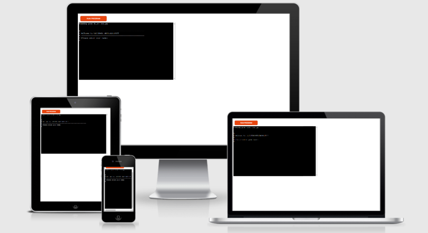
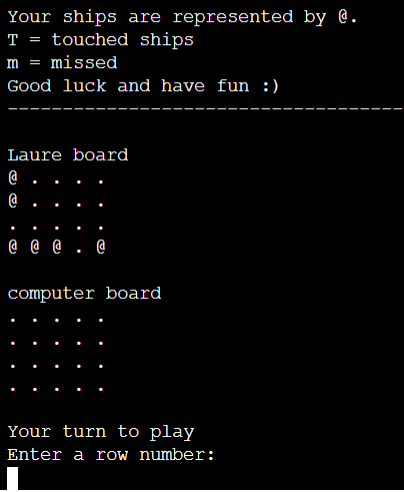

<h1 align="center"> Project 3 for Code Institute formation | A Battleship - Python terminal game</h1>

# USER Story
# Deployment (clone)
#

[View the live project here.](https://battleships-laure.herokuapp.com/)

A Battleship is a Python terminal game built as part of a project for the [code institute](https://codeinstitute.net/) (training to become a web developer) to develop and show my skills in Python. 

Players can play against the computer to try find the computer's ships before the computer find the player's ships

<h3 align="center"></h3>

# Table of content

Open the Table of Contents here

- [How to play](#how-to-play)
- [Features](#features)
- [Data Model](#data-model)
- [Technologies used](#technologies-used)
- [Testing](#testing)
- [Deployment](#deployment)
- [Credits](#credits)
- [Acknowledgments](#acknowledgments)

# How to play
A Battleship is based on the classic BATTLESHIP game. More information can be found on [Wikipedia](https://en.wikipedia.org/wiki/Battleship_(game)).

In this version, the player enters its name, can choose the size of the board and the number of ships. Then 2 boards are generated, one for the player where ships are shown as @ and one for the computer where the ships are hidden.

The player starts the game by guessing a ship position in the computer board. If a ship is touched, it will be shown with "T" and if ships are missed, it will be shown with "m".

The player and the computer make guess one after the other and the winner is the one who touched first all the ships of the opponent.

<h3 align="center"></h3>

# Features
## Existing Features
- Player can choose the board size and the number of ships
    - Before starting the game, the player is asked if she/he wants to customize the game. 
    - When the answer is yes, the player can choose the size of the board and the number of ships. 
    - If the answer is no, the player will play with the default setting.

- Random board generation
    - Ships are randomly placed on both the player and the computer boards.
    - Player can see the positions of his/her ships but not where the computer's ships are.
- Play against the computer
- Accepts user input
- Give the scores
- Input validation and error-checking
    - Maximum board size is set
    - More boats than the board size could handle is invalid
    - the same guess cannot be entered twice (for the player and the computer)

## Features left to implement
- Allow the player to position ships themself on the board
- Ships larger than 1

# Data Model
2 classes are used (Board and GameParticipant).

- The class Board saves:
    - The type of board with can be Player or Computer
    - The ships position in an array
    - The touched ship positions in an array
    - The missed ship positions in an array
    - A function to print the board that displays the ships (only for the player board)
- The class GameParticipant:
    - Inherits the class Board
    - Saves the name
    - For future features it could store more data about each player

# Technologies used
## Languages used
- [Python](https://en.wikipedia.org/wiki/Python_(programming_language))

## Frameworks and Programs used
- [Gitpod](https://gitpod.io/workspaces) | used to code, commit to git and push the codes to github

- [GitHub](https://github.com/) | used to store the project code, show it and deploy the website

- [Powerpoint](https://simple.wikipedia.org/wiki/Microsoft_PowerPoint) | used to create images from screenshots

- [Word](https://en.wikipedia.org/wiki/Microsoft_Word) | used to correct the grammar

- [am I responsive?](http://ami.responsivedesign.is/) | used to look at the responsiveness of the website 

- [DeepL](https://www.deepl.com/) | used to translate words from French to English and to write the content of the website and the 'Read me' file

- [PEP8 online checker](http://pep8online.com/) | used to check the python code

## Frameworks and Programs used
- [Git](https://git-scm.com/) | used as version control system

# Testing
- Passed the code in [PEP8 online checker](http://pep8online.com/checkresult) without showing errors.
- Invalid data have been entered
- Tested in local terminal and in Heroku terminal

# Deployment
The project was deployed on Heroku after registering for an account
- Steps for deployment:
    - Save the project on Github
    - Create a Heroku app
    - Set the Procfile
    - Set the requirement.txt file to enable the installation of the package numpy
    - Link the Heroku app to the repository
    - Click on Deploy

# Credits
## Idea credits
The Idea to create from the project example Idea suggested by code institute for the creation of the project. 

## Code credits
- ### General
[code institute](https://codeinstitute.net/) - Parts of the code throughout the website have been adapted from the courses.

[w3schools](https://www.w3schools.com/) - Used throughout the project.

[stakocverflow](https://stakocverflow.com/) - Used throughout the project.

- ### Game code credit
A video made by [code institute](https://codeinstitute.net/) that illustrates a similar project has been used for inspiration for the code. The video does not show the entire code for the project but the class Board has been inspired from that video. As the video is a course content, it is not freely available online. For reference, the video is in the course --> Portfolio3 --> Portfolio Project Scope (version of the 20th September 2021)

- ### Read me file credits
The code was adapted from the readme file from my first and second projects and the sample README.md from [code institute](https://codeinstitute.net/) in the  course --> Portfolio3 --> Portfolio Project Scope (version of the 20th September 2021)

# Acknowledgments
- My mentor, Nishant Kumar, for guiding me through the project, for giving me feedback to improve the code.

- The Slack community for clarifying certain concepts, sharing tips and links.

- The tutors in Code institutes for helping with the codes.
