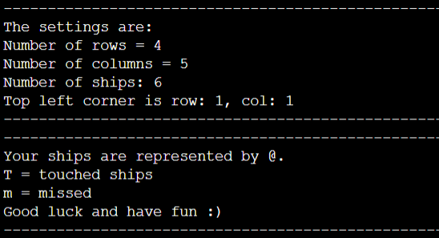
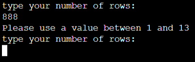
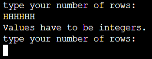
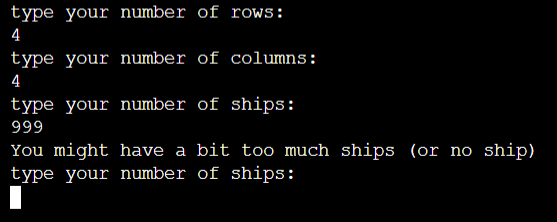

<h1 align="center"> Project 3 for Code Institute formation | A Battleship - Python terminal game</h1>

[View the live project here.](https://battleships-laure.herokuapp.com/)

A Battleship is a Python terminal game built as part of a project for the [code institute](https://codeinstitute.net/) (training to become a web developer) to develop and show my skills in Python. 

Players can play against the computer to try to find the computer's ships before the computer finds the player's ships.

<h3 align="center"></h3>

# Table of content

Table of Contents here

- [How to play](#how-to-play)
- [User Experience](#user-experience)
- [Features](#features)
- [Data Model](#data-model)
- [Technologies used](#technologies-used)
- [Testing](#testing)
- [Deployment](#deployment)
- [Credits](#credits)
- [Acknowledgments](#acknowledgments)

# How to play
A Battleship is based on the classic BATTLESHIP game. More information can be found on [Wikipedia](https://en.wikipedia.org/wiki/Battleship_(game)).

In this version, the player enters his/her name, can choose the size of the board and the number of ships. Then 2 boards are generated, one for the player where ships are shown as @ and one for the computer where the ships are hidden.

The player starts the game by guessing the position of a ship on the computer board. If a ship is hit, it will be indicated by "T" and if ships are missed, it will be indicated by "m".

The player and the computer guess one after the other and the winner is the one who hits all the opponent's ships first.

<h3 align="center"></h3>

# User Experience
## Visitor Goals
  - As a Visitor, I want to play a game to have fun
  - As a Visitor, I want to understand the parameters easily
  - As a Visitor, I want to be informed if I enter an incorrect value and have the option to re-enter the value
  - As a Visitor, I want to understand why an incorrect value is incorrect and get guidance on how to enter a correct one
  - As a Visitor, I want to be able to get out of the game easily

# Features
## Existing Features
- The player can choose the size of the board and the number of ships
    - Before starting the game, the player is asked if he/she wants to customise the game
    - If the answer is yes, the player can choose the size of the board and the number of ships 
    - If the answer is no, the player will play with the default setting

- Random board generation
    - The ships are placed randomly on the player and computer boards
    - The player can see the position of his ships but not the computer's ships
- Playing against the computer
- Accepting user input
- Giving scores
- Input validation and error-checking
    - There is a maximum board size
    - More ships than the board size could handle is invalid
    - The same guess cannot be entered twice (for the player and the computer)

## Features left to implement
- Allow the player to position ships themself on the board
- Ships larger than 1x1

# Data Model
2 classes have been created (Board and GameParticipant)

- The class Board saves:
    - The type of board which can be Player or Computer
    - The position of ships in an array
    - The position of touched ships in an array
    - The position of missed ships in an array
    - A function to print the board
- The class GameParticipant:
    - Inherits the class Board
    - Saves the name
    - For future features it could store more data on each player

# Technologies used
## Languages used
- [Python](https://en.wikipedia.org/wiki/Python_(programming_language))

## Frameworks and Programs used
- [Gitpod](https://gitpod.io/workspaces) | used to code, commit to git and push the codes to github

- [GitHub](https://github.com/) | used to store the project code, show it and deploy the website

- [Powerpoint](https://simple.wikipedia.org/wiki/Microsoft_PowerPoint) | used to create images from screenshots

- [Word](https://en.wikipedia.org/wiki/Microsoft_Word) | used to correct the grammar

- [am I responsive?](http://ami.responsivedesign.is/) | used to look at the responsiveness of the website 

- [DeepL](https://www.deepl.com/) | used to translate words from French to English and to write the content of the website and the 'Read me' file

- [PEP8 online checker](http://pep8online.com/) | used to check the python code

- [Git](https://git-scm.com/) | used as version control system

# Testing
## Code validation
- Passed the code in [PEP8 online checker](http://pep8online.com) without showing errors.

## Manual testing
The game was tested manually in the local terminal and in the Heroku terminal by playing many games with many different settings and entering incorrect values.

## Testing User Stories
  - As a Visitor, I want to play a game to have fun.
    - The game is easy to understand. The player can customise the size of the board and the number of ships to best suit the way the player wants to play and have fun.
  - As a Visitor, I want to understand the parameters easily.
    - Settings are displayed.
    <h3 align="center"></h3>
  - As a Visitor, I want to be informed if I enter an incorrect value and have the option to re-enter the value. As a Visitor, I want to understand why an incorrect value is incorrect and get guidance on how to enter a correct one.
    - When the player enters an incorrect value, he/she is advised to enter a correct value.
    <h3 align="center"></h3>
    <h3 align="center"></h3>
    <h3 align="center"></h3>
    <h3 align="center"></h3>
  - As a Visitor, I want to be able to get out of the game easily.
    - The player can get out of the game after each round.

# Deployment
The project was deployed on Heroku after registering for an account
- Steps for deployment:
    - Save the project on Github
    - Create a Heroku app
    - Set the Procfile
    - Set the requirement.txt file to enable the installation of the package numpy
    - Link the Heroku app to the repository
    - Click on Deploy

## Making a Local Clone
- Log in to GitHub and locate the GitHub Repository
- Click the Code drop down menu
- Either download the ZIP file, unpackage locally and open with IDE OR to clone the repository using HTTPS, under "Clone with HTTPS", copy the link
- Open Git Bash
- Change the current working directory to the location where you want the cloned directory to be made
- Type git clone, and then paste the URL you copied
- Press Enter. Your local clone will be created

# Credits
## Idea credits
The idea of creating a battleship game came from the sample project idea proposed by Code Institute. 

## Code credits
- ### General
[code institute](https://codeinstitute.net/) - Parts of the code throughout the website have been adapted from the courses.

[w3schools](https://www.w3schools.com/) - Used throughout the project.

[stakocverflow](https://stakocverflow.com/) - Used throughout the project.

- ### Game code credit
A video made by [code institute](https://codeinstitute.net/) that illustrates a similar project has been used for inspiration for the code. The video does not show the entire code for the project but the class Board has been inspired from that video. As the video is a course content, it is not freely available online. For reference, the video is in the course --> Portfolio3 --> Portfolio Project Scope (version of the 20th September 2021)

- ### Read me file credits
The code was adapted from the readme file from my first and second projects and the sample README.md from [code institute](https://codeinstitute.net/) in the  course --> Portfolio3 --> Portfolio Project Scope (version of the 20th September 2021)

# Acknowledgments
- My mentor, Nishant Kumar, for guiding me through the project, for giving me feedback to improve the code

- The Slack community for clarifying certain concepts, sharing tips and links

- The tutors in Code institutes for helping with the codes
